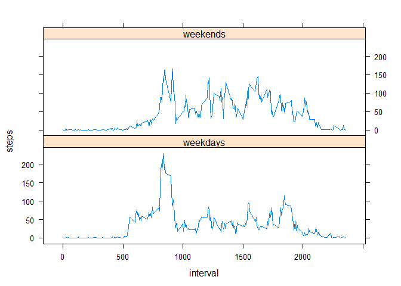

# Reproducible Research: Peer Assessment 1 By Michael


## Loading and preprocessing the data
We assume that the activity.zip file exists in the current directory, and unzip it again to make sure the activity.csv file in the same directory, and read the data with column name so that we do not need to convert the "Date" column from Factor/Character to Date.

```r
unzip("activity.zip")
data <- read.csv("activity.csv", colClasses=c("integer", "Date", "integer"))
```

## What is mean total number of steps taken per day?
* total number of steps taken per day is calculated and stored in steps_per_day, with the NA value removed.


```r
steps_per_day <- tapply(data$steps, data$date, sum, na.rm=TRUE)
```

* Histogram of the total numbers of steps per day  

```r
hist(steps_per_day)
```

 

* Mean and Median of the total numbers of steps per day, the NA value is not considered.


```r
mean(steps_per_day, na.rm=TRUE)
```

```
## [1] 9354.23
```

```r
median(steps_per_day, na.rm=TRUE)
```

```
## [1] 10395
```

## What is the average daily activity pattern?
* average number of steps taken in the 5-minute interval is calculated and stored in steps_per_interval, with the NA value removed


```r
steps_per_interval <- tapply(data$steps, data$interval, mean, na.rm=TRUE)
plot(names(steps_per_interval), steps_per_interval, xlab='5-min interval', ylab='average steps',type='l')
```

 

* the 5-min interval with highest average steps

```r
names(steps_per_interval)[which.max(steps_per_interval)]
```

```
## [1] "835"
```

## Imputing missing values
*  total number of missing values in the dataset

```r
narow <- which(is.na(data$steps))
length(narow)
```

```
## [1] 2304
```

* **Strategy for filling in the missing values in the dataset**  
The missing values are replaced by the the mean step for that 5-minute interval. E.g., the missing value of 10/1/2012 00:00 is replaced by the average value of 00:00. The filled data has been stored in data2.  


```r
data2 <- data
for (index in 1:dim(data2)[1]) { 
    if (is.na(data2$steps[index])) {
        data2$steps[index] <-
            steps_per_interval[which(names(steps_per_interval) 
                == as.character(data2$interval[index]))[1]]
    }
}
```

* Histogram of the total number of steps taken each day on the new dataset and the mean and median of total number of steps taken per day have been reported.  


```r
steps_per_day2 <- tapply(data2$steps, data2$date, sum)
hist(steps_per_day2)
```

 

```r
mean(steps_per_day2, na.rm=TRUE)
```

```
## [1] 10766.19
```

```r
median(steps_per_day2, na.rm=TRUE)
```

```
## [1] 10766.19
```

It seems a coincidence that the new mean and median are same, since if we use a different strategy, such as simply relplace the NA values with number 1, the mean and median are different.  

*Do these values differ from the estimates from the first part of the assignment? What is the impact of imputing missing data on the estimates of the total daily number of steps?  

The mean and median are different from the first part, since in the previous part we are average (and get median) in a smaller data, while after fill the NA values, we have more data available to calculate the mean. If the NA values are replaced by mean in the first part, then the mean should not change, but as we replaced it with the average value of each interval.


## Are there differences in activity patterns between weekdays and weekends? 

* A new factor variable "weekdays" is generated based on the weekdays of the date, and then converted "weekends" or "weekdays".


```r
data2$weekdays <- weekdays(data2$date)
isWeekend <- data2$weekdays == "Sunday" | data2$weekdays == "Saturday"
data2$weekdays[which(isWeekend)] <- "weekends"
data2$weekdays[which(!isWeekend)] <- "weekdays"
data2$weekdays <- as.factor(data2$weekdays)
data3 <- aggregate(steps ~ interval+weekdays, data2,mean)
```

* A panel plot has been generated with lattice

```r
library(lattice)
xyplot(steps ~ interval | weekdays, layout = c(1,2), data=data3, type='l') ## Plot with 2 panels
```

 
